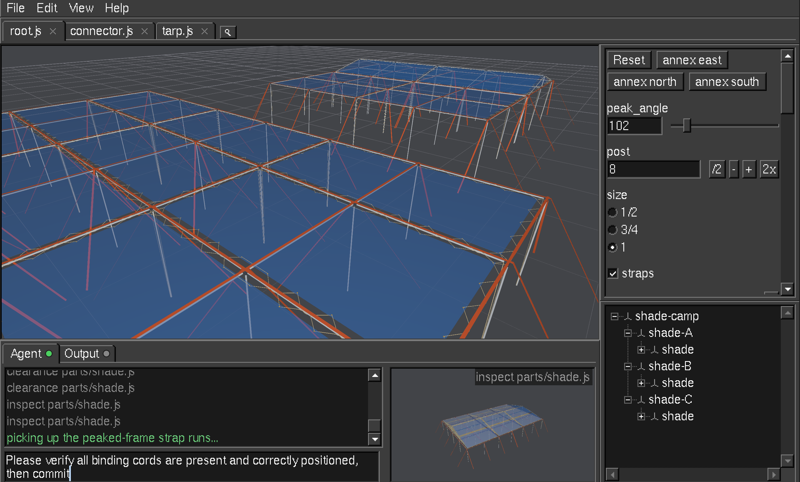

# ODM
*CAD for the agent era*



To you, ODM is a CAD program for building parametric 3D objects at the speed of AI. To your agents, its a framework and toolkit built from the ground up for their convenience. Instead of making LLMs operate software designed for humans, ODM allows them to work in their native language: code and CLI tools.

__WARNING: ODM is still in early development, is currently Linux-only and has not yet had a stable release.__

Features:
- Use the model and coding harness of your choice (Claude Code, Codex, OpenCode, etc) inside ODM
- Fully git-compatible, since projects are just code
- Forward compatibility - a new version will never break an existing project
- Export to STL or a dynamic web app
- Timeless UI/UX
- Fully open source and permissively licensed

To build and install under `$HOME/.local/bin` clone this repo and run `scripts/install.sh`. Official release and pre-built binaries coming soon.

Runs on Linux, macOS (Apple silicon) and Windows (x86_64). Config lives in `~/.config/odm/config.toml` and data in `~/.local/share/odm/` on Linux and macOS (the XDG layout, `$XDG_CONFIG_HOME`/`$XDG_DATA_HOME` honored); macOS uses the same paths rather than `~/Library`. On Windows they are `%APPDATA%\odm\config.toml` and `%LOCALAPPDATA%\odm\`.

## Developing

After cloning, run `scripts/patch-deps.sh` once: it materializes the patched crates (`patches/`) that `Cargo.toml` points at in the gitignored `vendor/` (install.sh runs it too). `cargo test --workspace` is the gate. CI is GitHub Actions, manual trigger only (push the commit first):

```sh
gh workflow run test.yml -f ref=$(git rev-parse HEAD)            # both Linux lanes; -f lanes=all|windows|…
gh workflow run run.yml -f lane=linux-arm64 -f ref=$(git rev-parse HEAD) -f command='cargo test --workspace --test e2e'
gh run watch $(gh run list -L1 --json databaseId -q '.[0].databaseId')
```

Editing `scripts/Containerfile` or `rust-toolchain.toml` needs `gh workflow run container.yml` first (the Linux lanes pull the image matching those files).
